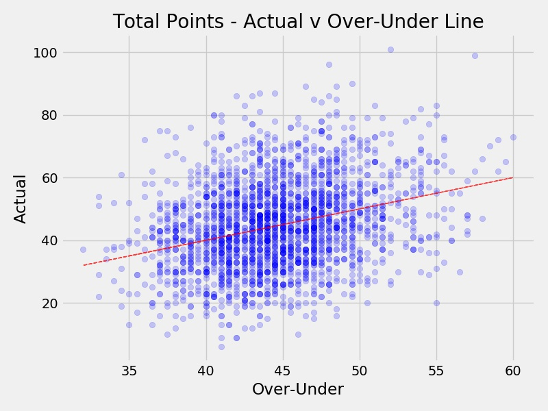
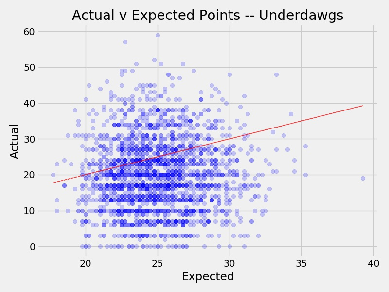
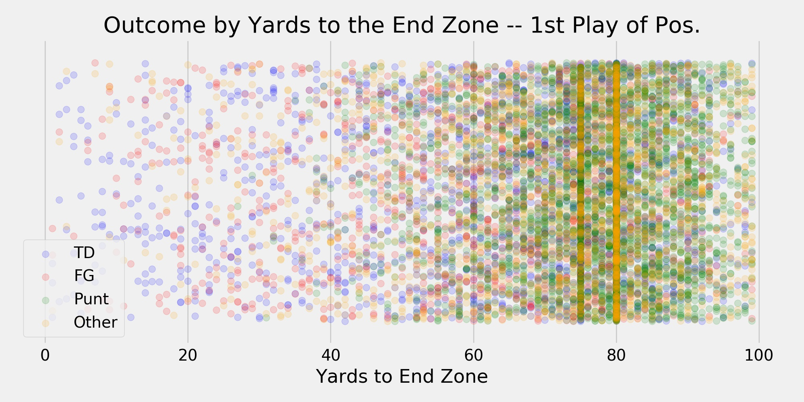
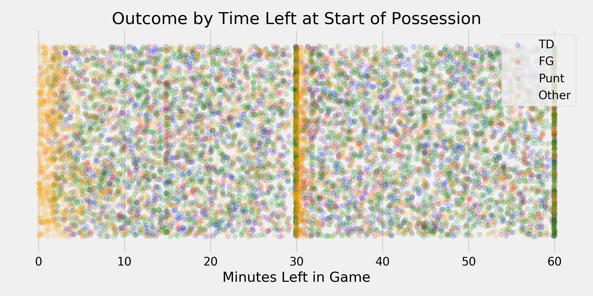

# A Deeply Silly Idea: Predicting Possession Outcomes for NFL Games

## Introduction

The goal of this project is to attempt to predict the outcome of a possession in an NFL game, based only on information available at the start of the possession. For the purposes of this analysis, possessions can end in one of four ways - the possessing team will score a TD, successfully kick a FG (blocks/misses are not included), attempt a punt (despite the confusion, blocks are included in this outcome), or other (anything else that happens - e.g. end of half/game, turnover on downs, fumble lost, safety, etc.) 

## The Data

The data used for this analysis comes from two Kaggle datasets (found [here](https://www.kaggle.com/maxhorowitz/nflplaybyplay2009to2016) and [here](https://www.kaggle.com/tobycrabtree/nfl-scores-and-betting-data#spreadspoke_scores.csv)). The first dataset contains every play in the NFL from 2009 through the 2018 season. It contains ~64k possessions composed of ~450k plays each with 255 different features. The second dataset contains historical information about NFL games all the way back to 1966. It has ~12,500 games with 17 features detailing the game locations, teams, outcomes, etc. 

From both datasets, the most important features for this analysis are the ones we can know before the start of a possession.

- Game Situation - Distance to the end zone, score, time left in the game, possessing team is home team, etc.
- Team v Opponent - Relative strength (as captured by betting line/spread), expected points in game, leading or trailing, possessing team is favorite, etc.

For the most part the game situation data is from the plays dataset and the team v opponent data is from the historical gambling set.

To minimize data leakage, I used the 2009 - 2017 seasons as my training data and the 2018 season as my hold-out data for validation. To make sure this approach didn't run up against some sort of trend in scoring, I looked at season over season scoring totals. 

Though there is a slight uptick in scoring in 2018, it doesn't appear to be anything substantial.

## The Features

**Features from datasets:**

| **Feature** | **Type** | **Description** |
| --- | --- | --- |
| yardline_100 | int | The distance from the end zone to start the possession. |
| game_seconds_remaining | int | Total seconds remaining in the game (3600 seconds in a game). |
| posteam_score | int | Possessing team score. |
| defteam_score | int | Defensive team score. |
| posteam_timeouts_remaining | int | Possessing team timeouts (3 per half). |
| defteam_timeouts_remaining | int | Defensive team timeouts (3 per half). |
| spread | float | The point spread on the game. |
| total | float | The over-under line for the game. |

**Features engineered:**

| **Feature** | **Type** | **Description** |
| --- | --- | --- |
| pos_fave | bool | Whether or not the possessing team is the favorite. |
| pos_home | bool | Whether or not the possessing team is the home team. |
| is_EOH | bool | Whether or not the possession starts in the last two minutes of either half. |
| pos_EP_total | float | Based on the spread and total, the possessing team's expected points for the game. |
| def_EP_total | float | Based on the spread and total, the defensive team's expected points for the game. |
| pos_EP_pace | float | The possessing team's progress against their expected points (expected points * percent of game elapsed). Positive figures mean the team is ahead of expectation, negative means behind. |
| def_EP_pace | float | The possessing team's progress against their expected points (expected points * percent of game elapsed). Positive figures mean the team is ahead of expectation, negative means behind. |
| def_EP_total | float | Based on the spread and total, the defensive team's expected points for the game. |
| posteam_timeouts_remaining | int | Possessing team timeouts (3 per half). |
| defteam_timeouts_remaining | int | Defensive team timeouts (3 per half). |
| pos_pp_cume_yards | int | Possessing team cumulative yards gained in the game to the start of the possession. |
| pos_play_count | int | Count of possessing team plays run in the game to the start of the possession. |
| pos_yds_play | int | Yards per play for possessing team in the game to the start of the possession. |

There is a lot of co-linearity amongst these features (as several as just linear functions of others), but since I am only concerned with predictive prowess (and not intepretability), I didn't do much to suppress it.

## EDA

Exploring the data, I found some fairly obvious relationships exist between the prevalance of scoring and expected scoring.

**Surprise!** Games expected to have a more of points, generally have more points!

Interestingly, favorites appear to underperform expectation....

But, so do underdogs. Seems like Vegas might know something about human behavior (*hint: it's way less fun to bet the under*).....

There are also some interesting relationships between time and field position and the outcome of a possession.

Somewhat obviously, the further you start from the end zone, the more likely you are to punt. The bright orange lines at the 20 and 25 are touchbacks (the touchback rule was changed in 2016).

This is the same kind of plot, but this time including all plays (not just the start of possessions).

Most of the noteworthy information here is in the last parts of each half. If a team takes possession very near the end of a half, the 'other' outcome becomes more likely than at other times.

## Predicting Outcomes

Possession outcomes are pretty random and don't necessarily lend themselves well to prediction. Random chance would guess correctly about 25% of the time, but since our outcomes are not uniformly distributed, the baseline for a prediction model is to predict that every possession would result in a punt, which occurs 40.6% of the time (in the training data). Of the ~58k training possesions, the breakdown of outcomes is:

| **TD** | **FG** | **Punt** | **Other** |
| --- | --- | --- | --- | 
| 19.5% | 13.9% | 40.8% | 25.8% |

# OOPS, I DID IT AGAIN.....

## The Models...

| **Model** | **Test Accuracy** | **Hold-out Accuracy** |
| --- | --- | --- |
| Logistic Regression | 50.5% | 48.5% |
| Random Forest (Gen1) | 51.5% | 50.2% |
| AdaBoost Classifier | 51.4% | 49.8% |
| MLP | 52.0% | 50.4% |
| Naive Bayes | 46.8% | You get the idea....|
| Random Forest (Gen2) | 50.7% | 49.4% |

I tried all the models, but what I found was that the issue is not a question of which model I chose to throw at the data, but the features I chose to throw at the models. 

## Random Forest

Random Forests performed almost as well as the MLP model and have the bonus of moderate interpretability. 

**1st Generation**

**2nd Generation**

*2nd generation included additional features - yards gained, plays run, and yards per play.

| **Outcome** | **Precision** | **Recall** |
| --- | --- | --- |
| FG | 0.39 | 0.07 |
| TD | 0.41 | 0.23 |
| Punt | 0.48 | 0.86 |
| Other | 0.61 | 0.42 |

The additional features resulted in a slight degradation of performance (down to 49.4%), but the new features were able to pop into the top 7. This didn't immediately make sense to me, and it's something I'd like to look into for future work. Further, I think understanding/creating partial dependence charts could help illuminate the interaction of the features and the outcomes.

## People: Not as smart as trees.....(or computers)

To really understand whether or not it's impressive for the machine to get an accuracy of over 50%, I put some humans to the test. I gave some of our classmates 100 randomly sampled possessions, giving them only the same information as I gave the machine. *The names of the participants have been changed to protect their identities.*

| **Name** | **Accuracy** |
| --- | --- |
| Ike | 44%|
| Tody | 29% |
| Gallison | 24% |
| **Dohn** | **47%** |
| Gatherer | 44% |
| Unabel | 38%% |

Turns out, 50.4% is pretty good - at least compared to us!

## Conclusions

It is incredibly difficult to predict the outcome of a possession at the start of it (at least it is difficult for all possessions - even if there are certain types that are seemingly easy). Fortunately for me, this is good thing. The randomness of the outcomes makes for a more compelling and fun experience trying to predict what will happen.

## Future Work
- Try reducing the history/training set - more heavily weighting the more recent information.
- Develop step-through probability model for all plays. One of the ways in which we can evaluate the quality of the probabilities we get for the start of the possession is to step-through a possession (or a series), starting with these values and see how a model does with more information.
- Given the unbalanced nature of the training data (and the validation data, too), I'm curious about other ways of stratifying the data that might give the models a better chance at guessing the drives that might end in scores.